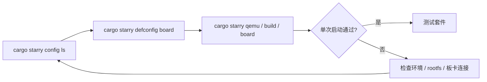
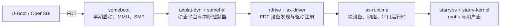

# StarryOS 快速上手

StarryOS 的快速上手建议先选择板卡配置，再执行常规构建或运行命令。`cargo starry config ls` 用于查看当前支持的板卡名称，`cargo starry defconfig <board>` 会把选中的板卡配置写入默认构建配置并记录到 StarryOS 命令快照，后续 `cargo starry build`、`cargo starry qemu`、`cargo starry uboot` 或 `cargo starry board` 会沿用这份配置。



## 1. 选择板卡配置

先查看仓库当前支持的 StarryOS 板卡配置：

```bash
cargo starry config ls
```

输出中的名称可以直接传给 `defconfig`：

```bash
cargo starry defconfig <board>
```

完成 `defconfig` 后，后续命令通常不需要再重复传 `--config`、`--target` 或 `--arch`。`quick-start` 是旧的便捷入口，后续会废弃；新的快速上手路径请使用 `config ls`、`defconfig` 和常规 `cargo starry` 子命令。

## 2. QEMU 快速启动

StarryOS 的 QEMU 启动通常包含 rootfs。当前 `qemu` 路径会在缺少 rootfs 时自动补齐，也可以显式先执行 `rootfs`。

### 2.1 RISC-V 64

`riscv64` 仍然是最适合作为首条验证路径的架构。它在文档和测试套件中都较常用，适合先确认 rootfs 和 QEMU 路径是否已经接通。

推荐第一次从 `riscv64` 开始：

```bash
cargo starry defconfig qemu-riscv64
cargo starry qemu
```

或显式分步执行：

```bash
cargo starry defconfig qemu-riscv64
cargo starry rootfs --arch riscv64
cargo starry build
cargo starry qemu
```

### 2.2 AArch64

如果后续会继续关注板级路径或与 Axvisor 的 AArch64 环境对齐，可以尽快补跑这一条。它也是 StarryOS 当前非常重要的一条验证路径。

```bash
cargo starry defconfig qemu-aarch64
cargo starry qemu
```

分步执行：

```bash
cargo starry defconfig qemu-aarch64
cargo starry rootfs --arch aarch64
cargo starry build
cargo starry qemu
```

### 2.3 x86_64

`x86_64` 适合作为 PC 类平台的补充验证路径。命令和其它架构基本一致，差异主要体现在目标 triple 和对应的 QEMU 配置上。

```bash
cargo starry defconfig qemu-x86_64
cargo starry qemu
```

分步执行：

```bash
cargo starry defconfig qemu-x86_64
cargo starry rootfs --arch x86_64
cargo starry build
cargo starry qemu
```

### 2.4 LoongArch64

LoongArch64 路径更适合在主流架构已经跑通之后再验证。这样出现问题时，也更容易区分是环境问题还是实验性架构路径带来的差异。

```bash
cargo starry defconfig qemu-loongarch64
cargo starry qemu
```

分步执行：

```bash
cargo starry defconfig qemu-loongarch64
cargo starry rootfs --arch loongarch64
cargo starry build
cargo starry qemu
```

> `starry rootfs` 当前使用 `--arch`，不是 `--target`。  
> `starry qemu` 的 `--target` 可接受完整 target triple，也可接受简写架构名。

## 3. 开发板快速启动

### 3.1 2K1000 与 VisionFive 2 的平台链路

2K1000 和 VisionFive 2 都使用动态平台路径。启动固件把 FDT 交给 `someboot`，`someboot` 完成早期启动、页表和 SMP 准备，运行期再由 `axplat-dyn`、`somehal` 和 `rdrive` 按 FDT 发现中断控制器与设备。设备驱动通过 `ax-driver` 注册为 RDIF 设备，最后由 `ax-runtime`、`ax-fs-ng`、`ax-net` 和 StarryOS 内核使用。



两块板的入口和根设备如下：

| 开发板 | 架构与 target | 构建配置 | 当前维护的启动入口 | 已验证的根设备 |
| --- | --- | --- | --- | --- |
| Loongson 2K1000 | LoongArch64，`loongarch64-unknown-none-softfloat` | `os/StarryOS/configs/board/ls2k1000.toml` | TFTP 加载镜像，U-Boot `go` 携带 FDT 地址 | SATA SSD 上的 ext4 分区 |
| StarFive VisionFive 2 | RISC-V 64，`riscv64gc-unknown-none-elf` | `os/StarryOS/configs/board/visionfive2.toml` | `ostool-server` 远端板卡入口 | microSD/eMMC 上的 ext4 分区 |

> VisionFive 2 以前存在独立的静态平台 crate `axplat-riscv64-visionfive2`，该 crate 已删除。当前配置继续使用动态平台和 FDT，不应再添加或启用旧的静态平台 feature。

### 3.2 Loongson 2K1000

#### 3.2.1 平台与软件 crates

下面只列出与 2K1000 板级支持直接相关的 crates；StarryOS 完整的进程、系统调用和 VFS 依赖没有在此重复展开。

| 层次 | crate 或源码位置 | 2K1000 上的职责 |
| --- | --- | --- |
| StarryOS 入口 | `starryos`、`starry-kernel` | 组装 StarryOS 内核；`starry-kernel/loongarch64-low-va` 把用户地址空间限制在 2K1000 的 40-bit VA 能力内 |
| CPU 架构 | `ax-cpu` | LoongArch64 陷阱、上下文切换、用户态上下文和未对齐访问处理 |
| 早期启动 | `someboot` | 识别 U-Boot `argc/argv` 传入的 FDT，建立页表，切换 MMU，并准备 SMP 启动 |
| 动态平台 | `axplat-dyn`、`ax-hal`、`ax-plat` | 向 ArceOS/StarryOS 提供统一的 CPU、内存、时钟、中断、电源和平台信息接口 |
| 中断控制器 | `somehal`、`rdif-intc`、`irq-framework` | 从 FDT 探测 LS2K1000 LIOINTC，把级联中断转换为带 domain 的 `IrqId` 并分发 |
| MMIO 与内存 | `ax-mm`、`mmio-api` | 将设备资源交给 `iomap()`；LoongArch uncached DMW 映射策略保留在架构边界 |
| 驱动发现 | `rdrive`、`ax-driver` | 根据 FDT compatible 探测设备，并把设备适配成统一的 RDIF 接口 |
| 系统运行时 | `ax-runtime` | 按顺序初始化 IRQ、块设备、网络、RTC、串口和 SMP 运行时 |
| 根文件系统 | `ax-fs-ng`、`rsext4`、`rdif-block` | 扫描 AHCI block device 的分区表，选择并挂载 ext4 rootfs |
| 网络运行时 | `ax-net`、`rd-net` | 接管 GMAC 设备、注册 `eth0`，提供 DHCP、IP 和 socket 栈 |

2K1000 构建配置直接启用的板级 features 如下：

| feature | 作用 | 主要实现位置 |
| --- | --- | --- |
| `ax-hal/plat-dyn` | 选择动态平台路径 | `platforms/axplat-dyn/`、`platforms/somehal/` |
| `starry-kernel/loongarch64-low-va` | 使用适合 40-bit VA 的用户地址布局 | `os/StarryOS/kernel/src/config/loongarch64.rs` |
| `ax-driver/serial` | 探测 NS16550 串口并注册运行期 `ttyS0` | `drivers/ax-driver/src/serial/ns16550.rs` |
| `ax-driver/rtc` | 探测 `loongson,ls2k1000-rtc` 并初始化 wall clock | `drivers/ax-driver/src/time/loongson.rs` |
| `ax-driver/ls2k1000-ahci` | 探测板载 AHCI 控制器并注册 block device | `drivers/ax-driver/src/block/ahci.rs` |
| `ax-driver/ls2k1000-gmac` | 探测板载 GMAC 并注册 RDIF net device | `drivers/ax-driver/src/net/loongson_gmac.rs` |

其中 AHCI 的 FDT/MMIO 适配位于 `ax-driver`，控制器核心复用 `simple-ahci` crate，再通过 `rdif-block` 接入文件系统。当前 2K1000 AHCI 是同步 polling 路径。GMAC、RTC 和 NS16550 的板级适配目前都直接位于 `ax-driver`，并不存在单独的 `ls2k1000-gmac`、`ls2k1000-rtc` 或 `ls2k1000-serial` crate。LIOINTC 属于平台中断控制器，因此实现在 `somehal`，而不是普通设备驱动目录。

#### 3.2.2 构建镜像

先选择 2K1000 配置并构建：

```bash
cargo starry defconfig ls2k1000
cargo starry build
```

也可以不修改默认配置，直接显式指定配置文件：

```bash
cargo starry build \
  --config os/StarryOS/configs/board/ls2k1000.toml
```

默认 release 构建生成 `starryos` ELF 及同目录的 `starryos.bin`。文件通常位于 `target/loongarch64-unknown-none-softfloat/release/`；应以构建日志中 `[axbuild] starry artifact elf=...` 打印的实际路径为准。U-Boot/TFTP 使用的是对应的 `starryos.bin`。

实板启动前还需要准备：

- 可用的 U-Boot 网络和 TFTP 服务；
- 板载 SATA SSD 上可由 StarryOS 挂载的 ext4 rootfs；
- U-Boot 当前使用的 control FDT；
- 串口终端，用于查看启动日志并进入 StarryOS shell。

当前配置没有写死 `root=` 参数。已验证的磁盘布局中只有一个受支持的 ext4 分区，`ax-fs-ng` 会扫描 AHCI 设备和分区表后自动选择它作为根文件系统。如果磁盘上存在多个可用文件系统分区，应显式整理根设备选择，不能依赖“唯一分区”规则。

#### 3.2.3 通过 TFTP 和 U-Boot 启动

先把生成的 `starryos.bin` 放到 TFTP 根目录。下面的 IP 地址是示例，应按本地网络修改：

```bash
setenv ipaddr 192.168.99.20
setenv serverip 192.168.99.10
setenv netmask 255.255.255.0
```

[PR #1368](https://github.com/rcore-os/tgoskits/pull/1368) 实板验证使用的镜像与 FDT 加载地址如下。换用不同 U-Boot、内存布局或保留区时，应先确认这两段地址不会覆盖 U-Boot、FDT、内核或其它保留内存：

```bash
setenv loadaddr 0x9000000098000000
setenv fdt_addr 0x900000000a000000
```

可以一次性保存下面的启动脚本：

```bash
setenv starry_fdt_addr 'fdt addr ${fdtcontroladdr}'
setenv starry_fdt_size 'fdt header get fdt_size totalsize'
setenv starry_fdt_move 'fdt move ${fdtcontroladdr} ${fdt_addr} ${fdt_size}'
setenv starry_fdt_select 'fdt addr ${fdt_addr}'

setenv starry_load_tftp 'tftpboot ${loadaddr} starryos.bin'

setenv starry_hdr_entry 'setexpr hdr ${loadaddr} + 0x8'
setenv starry_read_entry 'setexpr.l kentry *0x${hdr}'
setenv starry_hdr_load 'setexpr hdr ${loadaddr} + 0x18'
setenv starry_read_load 'setexpr.l kload *0x${hdr}'
setenv starry_calc_off 'setexpr off ${kentry} - ${kload}'
setenv starry_calc_entry 'setexpr entry ${loadaddr} + ${off}'
setenv starry_print_entry 'printenv kentry kload off entry'

setenv starry_go 'go ${entry} ${fdt_addr}'
setenv boot_starry 'run starry_fdt_addr starry_fdt_size starry_fdt_move starry_fdt_select starry_load_tftp starry_hdr_entry starry_read_entry starry_hdr_load starry_read_load starry_calc_off starry_calc_entry starry_print_entry starry_go'
saveenv
```

之后每次启动执行：

```bash
run boot_starry
```

这段脚本依次完成四件事：

1. 把 U-Boot control FDT 复制到独立的 `fdt_addr`，避免后续加载覆盖；
2. 通过 TFTP 把 `starryos.bin` 加载到 `loadaddr`；
3. 从镜像头读取链接入口和链接加载地址，计算当前加载位置对应的实际入口；
4. 执行 `go ${entry} ${fdt_addr}`，由 U-Boot `argc/argv` ABI 把 FDT 地址交给 `someboot`。

正常启动时应能看到 `platform = loongson-2k1000`、LIOINTC/NS16550/AHCI/GMAC/RTC probe、ext4 mount、第二个 CPU 启动和 `Welcome to Starry OS!`。进入 shell 后可以继续检查：

```bash
mount
ip addr show eth0
date
ping <同网段主机地址>
```

仓库目前也没有 `ls2k1000-board.toml` 或 `test-suit/starryos/board-ls2k1000`，所以 `cargo starry board` 和 `cargo starry test board` 还不是 2K1000 的维护入口。普通 QEMU 同样没有 LS2K1000/2K1000 machine，无法覆盖 LIOINTC、AHCI 和 GMAC 实板路径。因此 `qemu-loongarch64` 只能验证 LoongArch64 通用路径，不能替代上面的手工物理板验证。

### 3.3 StarFive VisionFive 2

#### 3.3.1 平台与驱动 crates

VisionFive 2 通过 OpenSBI/U-Boot 提供的 FDT 进入 RISC-V 动态平台路径。`someboot` 会忽略 FDT 中 disabled 的 JH7110 S7 管理核，只启动可用的 U74 harts；运行期的外部中断由 `somehal` 的 RISC-V PLIC 路径处理。

| 层次或设备 | crate 或源码位置 | VisionFive 2 上的职责 |
| --- | --- | --- |
| StarryOS 入口 | `starryos`、`starry-kernel` | 组装 Linux 兼容内核、ext4、网络和设备文件系统 |
| CPU 与早期启动 | `ax-cpu`、`someboot` | RISC-V 陷阱/上下文、FDT CPU 枚举、页表和 U74 SMP 启动 |
| 动态平台与中断 | `axplat-dyn`、`ax-hal`、`somehal`、`rdif-intc` | 提供动态平台接口并管理 RISC-V timer、IPI 和 PLIC 中断 |
| FDT 驱动集成 | `rdrive`、`ax-driver` | 匹配 JH7110 compatible，准备 MMIO、clock、reset 和 IRQ 资源，并注册 RDIF 设备 |
| 时钟与复位 | `ax-driver/starfive-soc`、`rdif-clk`、`rdif-reset` | 注册 JH7110 SYSCRG clock/reset provider，为 SDIO 控制器准备时钟和复位 |
| JH7110 MMC 适配 | `starfive-jh7110-dwmmc` | 封装 JH7110 DW-MMC FIFO 偏移、参考时钟、总线能力和完成中断 |
| 通用 DW-MMC core | `dwmmc-host` | 实现 Synopsys DesignWare MMC host 的命令和 FIFO/IDMAC 控制器逻辑 |
| SD/MMC 协议 | `sdmmc-protocol`、`sdio-host2` | 完成 SD/eMMC 识别、初始化、块读写请求和 host capability 边界 |
| 块设备边界 | `rdif-block`、`dma-api`、`mmio-api` | 把 MMC host 暴露为 IRQ 驱动的 FIFO block device，并提供 DMA/MMIO 能力接口 |
| RTC 与串口 | `ax-driver` | 动态探测 `starfive,jh7110-rtc` 和 NS16550 串口，初始化 wall clock 与 `ttyS0` |
| 根文件系统 | `ax-runtime`、`ax-fs-ng`、`rsext4` | 接管 MMC block device，扫描并挂载 microSD/eMMC 上的 ext4 rootfs |

`visionfive2.toml` 直接启用下列 features：

| feature | 作用 |
| --- | --- |
| `ax-runtime/rtc` | 打开运行时 RTC 初始化链路 |
| `ax-driver/rtc` | 注册 JH7110 RTC FDT probe |
| `ax-driver/serial` | 注册运行期串口和 `ttyS0` |
| `ax-driver/starfive-jh7110-dwmmc` | 注册 JH7110 MMC；同时隐式启用 `starfive-soc`、block、SD/MMC 和 RDIF 依赖 |

#### 3.3.2 构建并通过远端板卡服务运行

先选择 VisionFive 2 配置并构建：

```bash
cargo starry defconfig visionfive2
cargo starry build
```

VisionFive 2 当前在仓库中维护的是 `ostool-server` 远端板卡入口。运行前需要：

- `ostool-server` 中存在类型为 `VisionFive2` 的可用板卡；
- 板卡 microSD 或 eMMC 中存在可挂载的 ext4 rootfs；
- 服务端已经配置好该板的固件、镜像传输、串口和复位流程。

单次构建并启动：

```bash
cargo starry board \
  --board-config os/StarryOS/configs/board/visionfive2-board.toml \
  --server <ip> \
  --port <port>
```

板级回归测试使用 `test-suit/starryos/board-visionfive2` 中的构建与运行配置：

```bash
cargo starry test board \
  --board visionfive2 \
  --server <ip> \
  --port <port>
```

测试会等待 StarryOS shell，然后执行 `echo STARRY_VISIONFIVE2_SHELL_OK` 并匹配输出。正常日志还应包含 U74 harts 启动、JH7110 SYS clock/reset provider、`starfive-jh7110-mmc` block device、ext4 rootfs 和 `/dev/console` 绑定到 `ttyS0`。

仓库目前没有 `visionfive2-uboot.toml`，因此 `cargo starry uboot` 不是 VisionFive 2 的已维护入口。若不使用远端板卡服务，需要根据本地 U-Boot/OpenSBI 的镜像格式、加载地址和 FDT 传递约定自行配置，不能直接套用 2K1000 的 `go` 脚本。

### 3.4 LicheeRV-Nano-SG2002

LicheeRV-Nano-SG2002 当前走 U-Boot 串口启动路径，适合在已经烧录并能正常进入 Linux 的开发板上验证 StarryOS。StarryOS 直接使用板上的 Linux 原生 ext4 根文件系统，默认根分区为 `root=/dev/mmcblk0p2`，不需要再单独制作 Starry rootfs 分区。

先选择 SG2002 构建配置：

```bash
cargo starry defconfig licheerv-nano-sg2002
cargo starry build
```

本地 U-Boot 串口启动使用常规 `uboot` 子命令。默认串口配置来自 `os/StarryOS/configs/board/licheerv-nano-sg2002-uboot.toml`，默认串口是 `/dev/ttyUSB0`，波特率为 `115200`：

```bash
cargo starry uboot \
  --uboot-config os/StarryOS/configs/board/licheerv-nano-sg2002-uboot.toml
```

这条路径会构建 `riscv64gc-unknown-none-elf` 目标，并根据 SG2002 的 ITS 模板生成 FIT image，随后通过 U-Boot 的 `loady` 串口传输到 `fit_load_addr = 0x82200000`，再执行 `bootm 0x82200000`。内核入口地址为 `kernel_load_addr = 0x80200000`。

远端板卡服务器启动使用常规 `board` 子命令：

```bash
cargo starry board \
  --board-config os/StarryOS/configs/board/licheerv-nano-sg2002-board.toml \
  --server <ip> \
  --port <port>
```

如果要运行完整板级测试，再使用 test-suit 入口：

```bash
cargo starry test board --board licheerv-nano-sg2002 --server <ip> --port <port>
```

这里的 `--board licheerv-nano-sg2002` 用于选择 `test-suit/starryos` 下的 LicheeRV-Nano-SG2002 用例；实际向 ostool-server 申请的物理板卡类型写在用例配置中，当前同样为 `LicheeRV-Nano-SG2002`。

## 4. 测试入口

StarryOS 除了单次启动外，更常见的验证方式是直接进入测试套件。这里的命令会读取 `test-suit/starryos` 下的用例配置并运行；迁出的压力测试通过 Starry app 命令显式选择。

```bash
# 全部 test-suit QEMU 测试
cargo starry test qemu --target riscv64gc-unknown-none-elf

# 压力测试
cargo starry app qemu -t stress/git --arch riscv64

# 仅运行指定用例
cargo starry test qemu --target aarch64-unknown-none-softfloat -c qemu-smp1/system

# 其他架构
cargo starry test qemu --target x86_64-unknown-none
cargo starry test qemu --target loongarch64-unknown-none-softfloat
```

如果需要板测：

```bash
cargo starry test board --board orangepi-5-plus --server <ip> --port <port>
cargo starry test board --board licheerv-nano-sg2002 --server <ip> --port <port>
```

详细说明见：[StarryOS 测试套件设计](/docs/build/starry/test)

若需要继续了解 case 结构、rootfs 组织方式和测试实现细节，可以继续阅读：

- [StarryOS 开发指南](/docs/development/starryos)
- [驱动架构与分层](/docs/architecture/driver/overview)
- [StarryOS 测试套件设计](/docs/build/starry/test)
- [QEMU 运行](/docs/build/overview)
